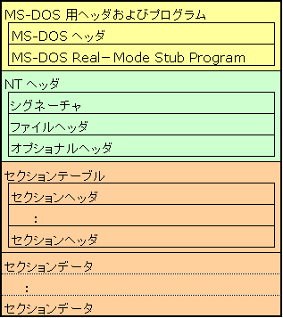

# PEanalyzer
PE header analyzer

for self-Educating and SecurityCamp2017.

# usage
```
python3 peanal.py [file]
```

analyze pe header and extract string literal


# Overview
まず、PEファイルフォーマットについて調べるところから始めた。以下の情報は、インプレスジャパン出版であるリバースエンジニアリングバイブル-コード再創造の美学-とO'REILLY出版であるアナライジング・マルウェアに記載してあることをもとに、自分で検証したりMicrosoft Portable Executable and Commom Object File Format Specificationで確認したことなどを含めて記載してある。最初に、PEファイルフォーマットの概要について大枠を述べる。PEファイルフォーマットは、ファイルの最初から順にDOS MZヘッダ、DOSスタブ、PEヘッダと続き、その後から各セクションごとにセクションテーブルと呼ばれる、種類ごとにまとめられたセクションと呼ばれる領域のサイズや開始アドレスなどの情報が指定されたヘッダが存在する。その後にセクションごとに情報が格納されいる。このセクションにはプログラムのコードやデータ、リソース情報などが含まれており、セクションはその役割に応じていくつかの種類がある。
次に、各ヘッダに関して順に説明する。まずはDOS MZヘッダである。DOS MZヘッダはPEファイルフォーマットの先頭にある領域で、winnt.h内ではIMAGE_DOS_HEADERとして定義されている。このIMAGE_DOS_HEADER構造体で重要なのは最初のメンバであるe_magicと最後のメンバであるe_lfanewの２つのみである。e_magicは0x4D,0x5Aという2バイトの値で、ASCII文字になおすと"MZ"である。余談だが、この"MZ"はPEを作ったMark Zbikowiski氏のイニシャルである。この値はファイルがPEファイルかどうかの確認としてよく使われる。e_lfanewは実際のPEのオフセットがどこにあるかを示す。つまり、PEヘッダであるIMAGE_NT_HEADERがどこに存在するのかを示す。PEファイルフォーマットの各ヘッダの構造体にはe_magicのようなマジックナンバがいくつか存在しており、今回自作したプログラムでは、今後汎用性を高めていくためと、うまくファイルを読み込めているかの確認を兼ねて各ヘッダのマジックナンバを照らし合わせることで、読み込んだファイルやデータが正しく解析されているか確かめながら解析した。
次に、PEヘッダについて説明する。PEヘッダはwinnt.hでIMAGE_NT_HEADERSとして定義されており、Signature,FileHeader,OptionalHeaderの3つのメンバから構成される。SignatureはPEヘッダの先頭4バイトを占め、PEファイルの場合は0x50,0x45,0x00,0x00となっており、これはASCII文字で"PE"である。次に、残り2つのメンバについて説明する。FileHeaderとOptionalHeaderは構造体である。これらは、それぞれwinnt.h上でIMAGE_FILE_HEADER、IMAGE_OPTIONAL_HEADER32として定義されている。まずIMAGE_FILE_HEADERについて説明する。今回の解析で必要だったのは、NumberOfSectionsメンバである。このメンバによって、セクションがいくつあるかを知ることができる。セクションの役割とその説明に関しては後述する。次にIMAGE_OPTINAL_HEADER32である。このヘッダにはコード全体のサイズを示すSizeOfCodeメンバや、ファイルが実行される時に実際の仮想メモリにロードされるアドレスを示すImageBaseメンバ、実行ファイルがメモリ上で実行を開始するアドレスであるAddressOfEntryPointなどがある。PEヘッダの次にセクション毎のセクションヘッダが格納されており、各セクションの最初の8バイトがセクション名を持つNameメンバになっている。セクションヘッダはIMAGE_SECTION_HEADERとして定義されており、セクション名の他に実際のバイナリ中でのアドレスを示すPointerToRawDataメンバとそのサイズを示すSizeOfRawDataメンバが存在する。
セクションは様々な種類があり、今回文字列の抽出を行いたいので、.textセクションの中から文字列抽出を行った。.textセクションにはプログラムのコードが含まれていて、プログラム中で使用する文字列もここに含まれている。
。具体的な実装について説明する。まず、言語はPython3.xで実装した。Pythonを選んだ理由は、以前gray hat pythonという本で簡単なwindowsデバッガの実装をしたことがあり、最終的にはこの課題をきっかけに自分でPEフォーマットの解析をするライブラリを実装してみたいと思ったからである。プログラムの解説に戻ると、まず構成としてwinnt_def.pyとpe.pyの2つのファイルに分割した。winnt_def.pyファイルはPythonのctypesというPythonからCのデータ型を扱うための標準ライブラリを使用して、各定数や構造体、共用体の定義を行った。次に、pe.pyである。このファイルでは、まず最初に引数からファイルをバイナリで読み込んで、それを各構造体に読み込むということを行った。まず、最初にIMAGE_DOS_HEADERを読み込んでe_magicの値をチェックし、もし違っている場合はメッセージを表示してプログラムが終了するようにした。次にe_lfanewの値から次の構造体であるIMAGE_NT_HEADERS32にデータを読み込んだ。ここでもSignatureの値を確認し、違う場合はメッセージとともにプログラムが終了するようにした。次にIMAGE_NT_HEADERS32中の後ろ2つの構造体IMAGE_FILE_HEADERからセクションの数を取得し、IMAGE_OPTIONAL_HEADER32まで入ったデータの次のデータから順に、セクションの数だけループ処理をして各セクションヘッダを読み込んだ。セクションヘッダを読み込んだあと、.textセクションのデータから文字列抽出を行った。文字列抽出については、セクションの最初から順にデータを調べていき、2文字以上のASCIIコード印字可能文字を抽出して表示することにした。制御文字は文字列としてカウントしないことにした。ここで2文字以上のASCII文字を選択した理由は、確認のためにOllydbgで文字列の表示をした際に2文字以上の文字列を表示しているのではないかと思ったためだ。実際に、Ollydbgで表示される文字列と今回作成したプログラムで表示された文字列はほぼ一緒だった。
汎用性という点ではまだ32bitのPEファイルしか読み込めないので不十分なところもあるが、今後64bitのPEファイルも扱えるようにする予定である。（2177文字)


# Task
PE（Portable Executable）ファイルフォーマットの構造を調べ、添付の[.NETアプリケーション](./dotNet-A-6/)から文字列を取得する機能を実装してください。具体的には、ファイルの先頭からヘッダを順次参照することで.NETアプリケーションの文字列（String）型リソースを取得するプログラムを作成してください。その際、以下の制限、規則に従ってください。 

- この.NETアプリケーションのみでなく、汎用的に文字列型を取得できるようなプログラム構造にしてください。 
- PEファイルを解析するような他者のコードは利用せず、自分で調べたPEファイルフォーマットの構造に従い、一からパースするプログラムを作ってください。 
- 参考にしたサイトや調べて分かったこと、作成したプログラムの工夫点などはできる限り詳細に記述してください。

---
## todo
- [] 文字列型の変数がどのセクションに格納されるのか、確認する
- [x] セクション名で調べることができる
- [] 実行コードと文字列リテラルの区別

### 作成したプログラムのリンク

### 参考にしたサイト、書籍

- リバースエンジニアリングバイブル
- https://www.glamenv-septzen.net/view/708
- http://hp.vector.co.jp/authors/VA050396/index.html
- http://home.a00.itscom.net/hatada/mcc/doc/pe.html

### 大変だったこと

- `IMAGE_OPTIONAL_HEADER32`構造体のサイズが、32bitと64bitで違うため、`IMAGE_FILE_HEADER`構造体中の`SizeOfOptionalHeader`メンバを参照して`IMAGE_NT_HEADERS`構造体のサイズを決める必要がある。(未実装)
- 

### PE File Format 
from http://hp.vector.co.jp/authors/VA050396/index.html


